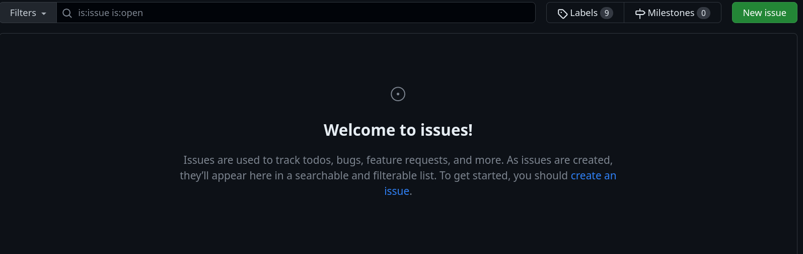
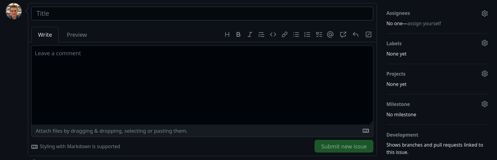
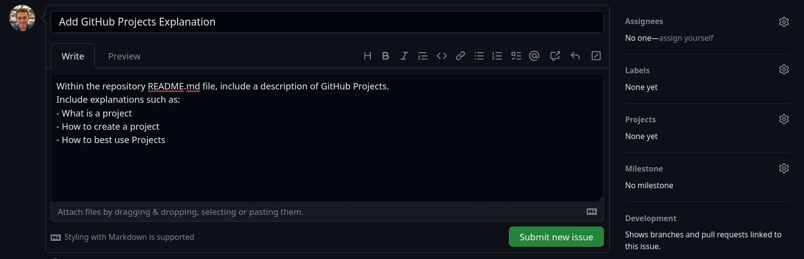
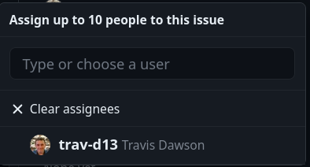
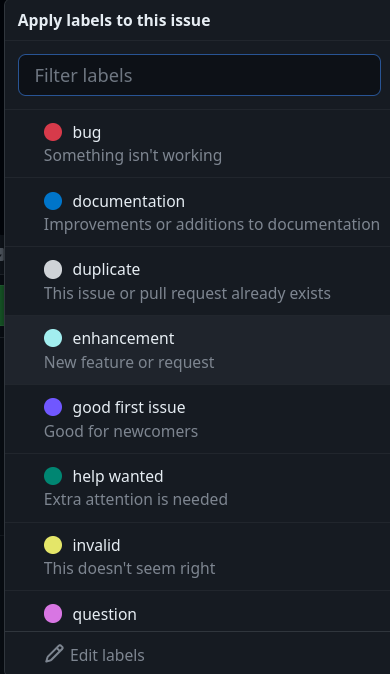
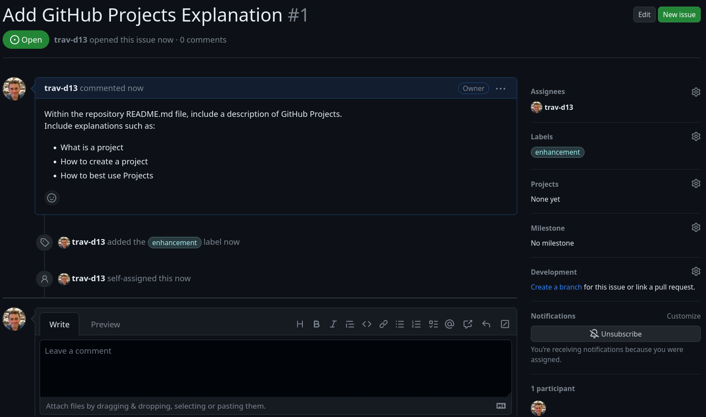
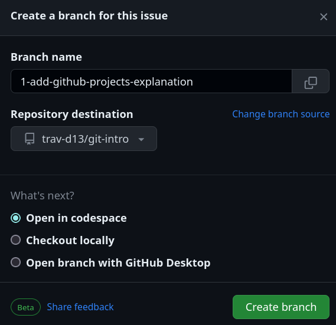

# Git
Many thanks to Leon Debnath (https://github.com/S010MON) the creator of original repository to help people understand Git.
This repository is a fork of his original.

## Contents
1. 
2. 
3. 
4. 
5. 
6. 

## What is Git
Git is a Version Control System (VCS) that is used to modify software to try out changes without losing the original working version.
Additionally, Git allows for the collaboration of teams on software projects, such that conflicts are minimized,
and the flow of production is optimized. Finally, Git has become the 'LinkedIn' of the Developer world, where people can 
look at your prior projects, see your interests and potentially collaborate.

## 1 How does Git work?
Git works using a graph implementation:

Here we have some software that we have built until point A.
```
A *
```

Normally we would develop this until a point B, changing the code at each stage until B might not be recognisable as the same code:
```
A *
  |
  |
  |
B *
```

Now if we realise that B doesn't work, we can `ctrl-z` our way back, but if we made three changes, and only the first was bad, then we have lost all of our progress.  Git allows us to **CHECKOUT** a branch (a new copy of the code) so that we can work on that, while keeping the original saved.

```
A *
  | \
  |  |
  |  |
  *  * B
```

Once we are done with development and testing, we can **MERGE** the two branches together:
```
A *
  | \
  |  |
  |  |
  | /
  * B
```

## 2. How can you use Git as an individual on your projects?
For individual work, this can be very useful, whenever you make significant changes, commit (i.e. save) your work and you will create snapshots in time that will give you points where you can return to without having to remember all the changes you made.  We can add messages to each commit that helps us understand code changes easily:

```
A * : Initialse project
  | 
B * : Add feature 1
  |
C * : Add feature 2
  |
D * : Fix bug in feature 1
```

Additionally, if you're doing something extremely experimental, that might not work, you can make a branch to test out on, and if it fails, just abandon it!

```
A * : Initialse project
  | \
  |   \
  |    | 
  |  B * : Add feature 1
  |    |
  |  C * : Add feature 2
  |    |
  |  D * : Didn't work ... fuck it!
```

## 3. Basic Git commands in the terminal
Git was built by Linus Torvalds (of linux fame) and is available on the terminal of all major operating systems.  Many IDEs have support inbuilt, and there are desktop Git editors that you can use.  However they all use the underlying terminal implementation.  It is very useful to first learn how to work with the Git terminal, because it is far more powerful than most editors, and if a language (like MATLAB) doesn't support Git natively, you can just use it in the terminal.

There are 4 main commands you should learn:
*note: for these examples I'm showing what it would look like for a linux terminal (*`user:~$`* which I have shortend to *`$`* you may have something else for windows such as *`C:\Users\name>`* so please don't include the *`$`* in your commands!*

#### init
Any folder can become a git folder with `init`.  You simply need to navigate to the folder in the terminal and run:
```bash
$ git init
```

#### status
Now that you have a git folder, you can check on the staus of the folder using `status`.  This will show you what changes are being tracked, and what is being ignored by git:
```bash
$ git status
```
The ouput should look like this:


#### add
If we have changed a file we need to track its changes to confirm that they are to be tracked by Git.
```bash
$ git add [file_name]
```
The image below shows that the file we saw earlier is now tracked and shows up in green:


Why don't we track all the files?  We if we compiled our Java code into a `.class` file, we don't want to record that.  It's a binary and not soruce code, so we can just recompile everything when we change the source anyway.  So make sure you select the right files to track when you have something like the below:


#### commit
To save our changes we use the `commit` command to save the state of the system at the current point.  You must add a message to all commits and you can do this using the `-m` tag.  IF you forget you will get a text editor pop-up that will ask you to add a message.  
```bash
$ git commit -m [MY_MESSAGE_FOR_THIS_COMMIT]
```
To use the `-m` tag, add a message in quotes like this:


#### Other
Additional commands include:
`$ git checkout` to checkout a new branch
`$ git branch` to see which branch you're on and what is available
`$ git help` to ge the help menu and list information about commands

## Connecting to GitHub in the terminal
Now this is useful, but the real power of Git comes when combined with the internet.  GitHub, BitBucket, and BitLocker are a few websites that allow you to store your code online, and share it with people.  GitHub is the most popular, but has faced some contoversy when it was bought by Microsoft, but is the system we will focus on.  We can clone a repository from online, make changes to it and then push those changes to the cloud to keep safe copies online or to share across multiple devices.  This works as follows:

#### Clone
You can make a clone of an online branch by using the `clone` command with the target URL from the repo you want.  For example, if you use the command below, you will make a clone of this workshop's repo.
```Bash
$ git clone https://github.com/S010MON/git-workshop
```

#### Exercise
Now try and modify the java code in this repo to add an extra function that prints your name instead of mine and commit that locally in the process we used above!  As a recap, the steps are:

   1. Clone
   2. Write code
   3. Add files
   4. Commit with message

#### Push
When we update the cloud with new local changes, it is called a push.  When we get new remote changes from the cloud, it is called a pull.  So we can use the `push` command to push our changes to the cloud.  However this does require you to have a GitHub account and to input your username and a token, this setup can be a little long, but once it's done you shouldnt't need to change it until your token expires.

To set up your local git to push to remote do the following steps:

  1. Go to your github account and select your user icon on the top right.  In the drop down menu select *Settings*
  
  2. Scroll down the page and look for *Developer Settings*
  
  3. Open up *Personal Access Tokens (Classic)*
  
  4. Create a new access token, setting the expiry to "No Expiration" and tick the "Repo" option
  
  5. You will be given a token code **copy it and don't close the page!** We now need to go back to the terminal
  
  6. Run the following commands:
    
  ```bash
  $ git config --global credential.helper store
  $ git push http://example.com/repo.git          # <- this will only appear if you haven't set a remote repo, so might not show!
  Username: [type your github username]
  Password: [Paste your token]
  ```
When you push you will notice that you overwrite the code on the cloud, when working in a group, this is not ideal, so in section 6 we will explore how to collaborate using different branches to avoid overwriting.

## 5. Using IntelliJ IDEA with Github
IntelliJ IDEA is a very popular Java IDE that features excellent Git integration.  When starting the IDE you can choose to clone a directory directly from GitHub by linking the IDE to your account by clicking the `Get from VCS` option.


Select the `GitHub` option and go through the steps of creating a token by selecting the `generate token` option.  It is important you do it this way, and not as outlined for the terminal above, as IDEA requires some extra permissions.  Once this is done, you will be able to manage all your github actions within the IDE.

## 6. Working as a Team

#### Pull Requests and Merging
When we work as a team, merging code together is the hardest part of collaboration.  However much we strive to use seperate files and compose functions into reuseable sub-components, there will always be accidental overwrites ore changes in requirements that cross the boundaries that we have set to work in.  This is where GitHub has a handy solution; pull requests.

To get started we create a new branch for the issue or feature we are going to add:


Next we write out code following the process above of getting the code to our local machine, making and testing changes, then pushing those changes to the cloud.  Once the code is ready and tested, we can create a new pull request to merge our code into the `main` or `master` branch. Fisrt we navigate to the `pull requests` menu:


And then select a new pull request, note we need to select which branch we are coming from, and which we are going to (N.B. the arrow goes in an unintuitive direction from right to left, so the left side is where you are pulling from!)


Once we have selected the branch we can see all the changes that will be added to the `main` from the `dev` branch


Clicking `create pull request` will publish a pull request to the team.  This does not yet merge your code, but does let everyone know the changes you are proposing and allows them to test, comment, and review the code you are adding.  


In this case I have added branch protection to the `main` branch to stop people from merging code without a review, this can really help to control the standard of your code and make sure that your `main` branch is always in working condition (Don't you just hate it when you want to show off your app and it isn't working right then?).  For more professional projects this can be a life saver if a server or application needs to stay up all the time.


Finally once the review has been completed by another member of the team, the button goes green and we can merge out code in! Notice that straight after the successful pull request, the option to delete the branch shows up in purple?  This is a very good idea, avoid always using the same branch (like a branch with your name) and instead work on a "one branch per issue" basis, as the number of branches you create will grow pretty big quickly, delete old ones to avoid duplicate names and getting lost in a swamp of old code.


#### Issues
Issues are a way to structure and allocate tasks that are still required to be completed within a repository. 



Each, issue has multiple field, including:
- **Title**: The title of the task to be completed (Main idea)
- **Comment**: A more in-depth description of the task to be completed. The comment should aim to provide enough information such than any individual has a good grasp of the task to be completed. 
- **Assignees**: Here you can assign individuals working on the project, to the specific tasks. 
- **Labels**: The label provides a label to the issue for further filtering. 
- **Projects**: The new issue will be listed within a project. (Projects explanation will be added at a later stage)
- **Development**: As you covered above in the use of branches, this allows you to specifically link a branch that aims to solve the described issue.

Below, I will show you each step in creating an issue, fulling in the fields, and making a branch for development.

1. Blank new Issue


2. Full in Title and Comment


3. Add in Assignees, Labels (Projects is skipped for now)

- After clicking on the Assignees label, members of the repository will be shown. Simply select the user you wish to assign to the task

- After clicking on the Labels button, select the most appropriate label. A custom label can also be added to best describe the Issue


4. Click submit new issue to create the issue
The below is the result of the issue being submitted


5. Create a branch to solve the issue
   1. Under Development (lower right) click, create new branch. This is the resulting screen displayed. Select create new branch

      
   2. A new branch has been created. To use this branch follow steps as previously explained
         ```
      git pull
      git checkout 1-add-github-projects-explanation
      ```